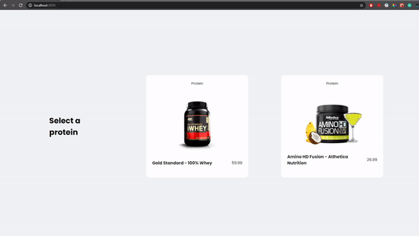

<h1 align="center">
    
     
    Next.js + Framer Motion
</h1>

<h4 align="center">
 Page Transitions with Framer Motion
</h4>

  

  

  

---

Made with ♥ by Isaque Igor :wave: [Get in touch!](https://www.linkedin.com/in/isaqueigor/)
